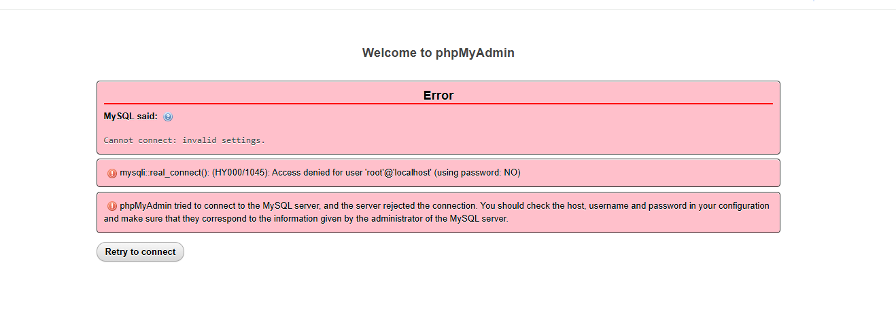
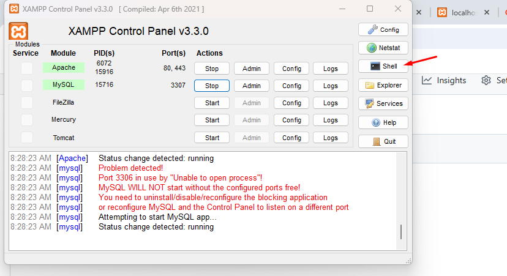

# xampp  phpmyadmin 
if the following error happen while you want to access phpmyadmin to get list of databases


# follow the following step to fix 

#
on the shell opened excute the following command 
```
mysqladmin --user=root password "password"
```
 then if the above commond is excuted without any error the password is changed to the one you provided 
 so the next step is  to put this password  in  C:\xampp\phpMyAdmin\config.inc.php to do that 
 ```
notepad C:\xampp\phpMyAdmin\config.inc.php
```
 then find the line having 
 $cfg['Servers'][$i]['password'] = '';
and but the  pasword inside the single qotation 
```
$cfg['Servers'][$i]['password'] = 'your_password';
```

now go to the browser and check  the error is fixed 


